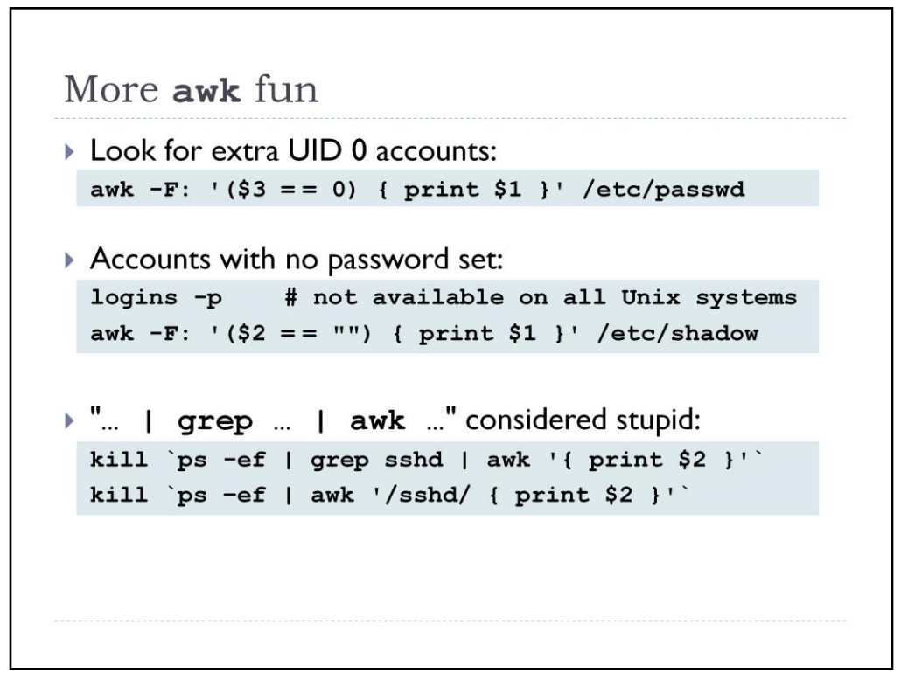

#AWK



To print the previous, the pattern matching line and next line: 
```
$ grep -C1 Solaris file
Linux
Solaris
AIX
```

-C is to print both lines above and below pattern.
```
$ awk '/Sola­ris­/{print x;prin­t;g­etl­ine­;pr­int­;ne­xt}­{x=­$0;}' file
Linux
Solaris
AIX
```

Remove duplicate lines using awk

```
$ awk '!($0 in array) { array[$0]; print }' temp
```

Print all lines from /etc/passwd that has the same uid and gid

```
$awk -F ':' '$3==$4' passwd.txt
```

Print only specific field from a file.

```
$ awk '{print $2,$5;}' employee.txt
```

**Awk If Else Example**: Generate Pass/Fail Report based on Student marks in each subject

```
$ awk '{
if ($3 >=35 && $4 >= 35 && $5 >= 35)
	print $0,"=>","Pass";
else
	print $0,"=>","Fail";
}' student-marks
Jones 2143 78 84 77 => Pass
Gondrol 2321 56 58 45 => Pass
RinRao 2122 38 37 => Fail
Edwin 2537 87 97 95 => Pass
Dayan 2415 30 47 => Fail
```