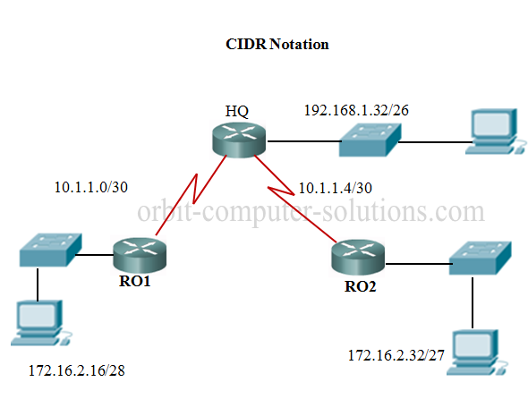

# CIDR (Classless InterDomain Routing)

CIDR (Classless Inter-Domain Routing) was introduced in 1993 (RCF 1517) replacing the previous generation of IP address syntax - classful networks. CIDR allowed for more efficient use of IPv4 address space and prefix aggregation, known as route summarization or supernetting.

CIDR introduction allowed for:

* More efficient use of IPv4 address space
* Prefix aggregation, which reduced the size of routing tables

CIDR allows routers to group routes together to reduce the bulk of routing information carried by the core routers. With CIDR, several IP networks appear to networks outside the group as a single, larger entity. With CIDR, IP addresses and their subnet masks are written as four octets, separated by periods, followed by a forward slash and a two-digit number that represents the subnet mask e.g.

**10.1.1.0/30**

**172.16.1.16/28**

**192.168.1.32/27** etc.

CIDR / VLSM Network addressing topology example

CIDR uses VLSM (Variable Lenght Subnet Masks) to allocate IP addresses to subnetworks according to need rather than class. VLSM allows for subnets to be further divided or subnetted into even smaller subnets. Simply, VLSM is just subnetting a subnet.

With CIDR, address classes (Class A,  B, and C) became meaningless. The network address was no longer determined by the value of the first octet, but assigned prefix length (subnet mask) address space. The number of hosts on a network, could now be assigned a specific prefix depending upon the number of hosts needed for that network.

Propagating CIDR supernets or VLSM subnets require a classless Routing Protocols – . A classless routing protocol includes the subnet mask along with the network address in the routing update.

**Summary routes determination**

Determining the summary route and subnet mask for a group of networks can be done in three easy steps:

1. To list the networks in binary format.
2. To count the number of left-most matching bits. This will give you the prefix length or subnet mask for the      summarized route.
3. To copy the matching bits and then add zero bits to the rest of the address to determine the          summarized network address.
 
The summarized network address and subnet mask can now be used as the summary route for this group of networks. Summary routes can be used by both static routes and classless routing protocols. Classful routing protocols can only summarize routes to the default classful mask.

ISPs could now more efficiently allocate address space using any prefix length, ISPs were no longer limited to a- 255.0.0.0 or /8,  255.255.0.0 or /16, or 255.255.255.0 or /24 subnet mask which before the advent of CIDR is known as classful network addresses.  Blocks of IP addresses could be assigned to a network based on the requirements of the customer, ranging from a few hosts to hundreds or thousands of hosts.

### CIDR Advantages

With the introduction of CIDR and VLSM, ISPs could now assign one part of a classful network to one customer and different part to another customer. With the introduction of VLSM and CIDR, network administrators had to use additional subnetting skills. 

The table below  shows allowed subnet and Hosts IP address for all The Classes

**Class A**

|No. of bits|Subnet Mask|CIDR|No. of Subnets|No. of Hosts|Nets * Hosts
|--|--|--|--|--|
|2|255.192.0.0|/10|2|4194302|8388604
|3|255.224.0.0|/11|6|2097150|12582900
|4|255.240.0.0|/12|14|1048574|14680036
|5|255.248.0.0|/13|30|524286|15728580

6

255.252.0.0

/14

62

262142

16252804

7

255.254.0.0

/15

126

131070

16514820

8

255.255.0.0

/16

254

65534

16645636

9

255.255.128.0

/17

510

32766

16710660

10

255.255.192.0

/18

1022

16382

16742404

11

255.255.224.0

/19

2046

8190

16756740

12

255.255.240.0

/20

4094

4094

16760836

13

255.255.248.0

/21

8190

2046

16756740

14

255.255.252.0

/22

16382

1022

16742404

15

255.255.254.0

/23

32766

510

16710660

16

255.255.255.0

/24

65534

254

16645636

17

255.255.255.128

/25

131070

126

16514820

18

255.255.255.192

/26

262142

62

16252804

19

255.255.255.224

/27

524286

30

15728580

20

255.255.255.240

/28

1048574

14

14680036

21

255.255.255.248

/29

2097150

6

12582900

22

255.255.255.252

/30

4194302

2

8388604
