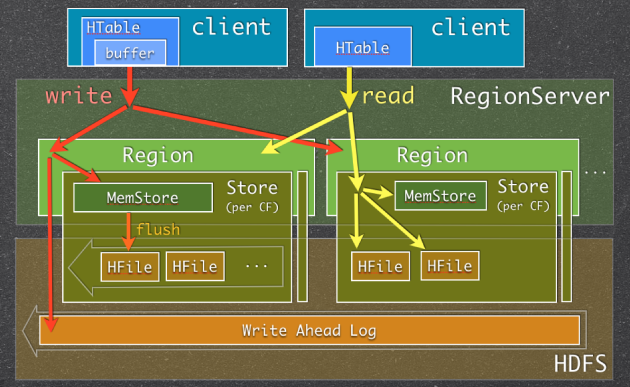

# HBase

### Housekeeping

First make sure HBase is running, with the following command in $HBASE_HOME: $ ./bin/start-hbase.sh
The HBase Shell is a Ruby script in ${HBASE_HOME}/bin/hirb.rb and to start the shell use: $ hbase shell
You can get an overview of all tables present in HBase using the list command (or restrict with list 'test.*').
To get a grip of how a certain table is structured use the describe command: describe 'test_table'
To check how the cluster is doing use: status 'simple' | 'summary' | 'detailed' (note that these are three
alternative parameters, providing different level of details; only specify one of them).
If you need to shut down the cluster use shutdown and to exit the shell use exit
1 

### Data Definition
create … to create a table. Pass table name, a dictionary of specifications
 per column family, and optionally a dictionary of table configuration.
Example create 'test_table', 'cf1', 'cf2'
alter … to alter the column family (CF) schema of a table. Note: the table
 must be disabled.
Examples
 To add the 'cf1' column family in table 't1':
 alter 't1', NAME => 'f1'
 To delete the 'cf2' column family from table 't2':
 alter 't2', {NAME => 'cf2', METHOD => 'delete'}
drop … to drop a table. Note: the table must be disabled.
disable … to disable a table, for example to drop it or to alter the schema.
enable … to enable a table after altering the CF schema.

### Data Manipulation
put … to put a 'value' into at specified table/row/column combination,
 also known as a 'cell' in HBase.
Example put 't1', 'row-key-1', 'cf1:col2', 'value'
delete … to mark a cell value as deleted. Note: deletes must match the
 deleted cell's coordinates (table/row/column) exactly. When
 scanning, a delete cell suppresses older versions.
Example delete 't1', 'row-key-1', 'cf1:col2'

### Query
count … to count the number of
 rows in a table. Note: this
 operation may take a long
 time.
Example count 'my_table'
get … to retrieve a single cell.
Examples
 To retrieve a cell with a
 certain row key:
 get 't1', 'rowkey-1'
 To retrieve a certain CF of a
 cell with a certain row key:
 get 't1', 'rowkey-1',
COLUMN => 'cf1'
 To retrieve a certain version
 of a cell with a certain row
 key:
 get 't1', 'rowkey-1',
TIMESTAMP =>
1371113904834
scan … to scan a table. Scanner
 specifications may include
 one or more of the following:
 FILTER, COLUMNS, LIMIT,
 STARTROW, STOPROW, or
 TIMESTAMP. If no COLUMNS
 are specified, all columns
 will be scanned. To scan all
 columns of a column family,
 leave the qualifier empty as
 in 'col_family:'
Examples
 See the next page, in the
 walk-through example
 
### Walk-through Example
 
 $ hbase shell
hbase> create 'orders', 'client', 'product'

hbase> describe 'orders'

hbase> put 'orders', 'joe_2013-01-13', 'client:name', 'Joe'

hbase> put 'orders', 'joe_2013-01-13', 'client:address', 'Hillroad 1, SF'

hbase> put 'orders', 'joe_2013-01-13', 'product:title', 'iPhone 5'

hbase> put 'orders', 'joe_2013-01-13', 'product:delivery', '2013-01-13'

hbase> scan 'orders'

hbase> put 'orders', 'jane_2013-02-05', 'client:name', 'Jane'

hbase> put 'orders', 'jane_2013-02-05', 'client:address', 'Sunset Drive 42, NY'

hbase> put 'orders', 'jane_2013-02-05', 'product:title', 'Samsung S4'

hbase> put 'orders', 'jane_2013-02-05', 'product:delivery', '2013-05-02'

hbase> get 'orders', 'jane_2013-02-05', {COLUMN => 'product:'}

hbase> scan 'orders', FILTER => "ValueFilter(=,'substring:Sunset')"

hbase> scan 'orders', { COLUMNS => ['client'], FILTER =>
 "ValueFilter(=,'substring:road')" }

hbase> scan 'orders', { COLUMNS => ['product'], FILTER =>
 "ValueFilter(=,'substring:2013-')" }

hbase> disable 'orders'

hbase> drop 'orders'

hbase> list

hbase> exit
Note: This walk-through example creates a table orders, adds some data (via put) and the retrieves the data using
get and scan. Finally, the table is removed again, using disable and drop.

### Other Useful Stuff

To execute HBase commands scripting-style, use:
$ {HBASE_HOME}/bin/hbase shell PATH_TO_SCRIPT
For a comprehensive reference on filters (to be used in FILTER => "..." within scan) see the Jira issue
HBASE-4176 'Exposing HBase Filters to the Thrift API' at https://issues.apache.org/jira/browse/HBASE-4176 which has
a MS Word document attached: https://issues.apache.org/jira/secure/attachment/12490608/Filter%20Language
%283%29.docx
Also, regarding filters, note that the following compare operators are available:
▪ LESS … <
▪ LESS_OR_EQUAL … <=
▪ EQUAL … =
▪ NOT_EQUAL … !=
▪ GREATER_OR_EQUAL … >=
▪ GREATER … >
▪ NO_OP