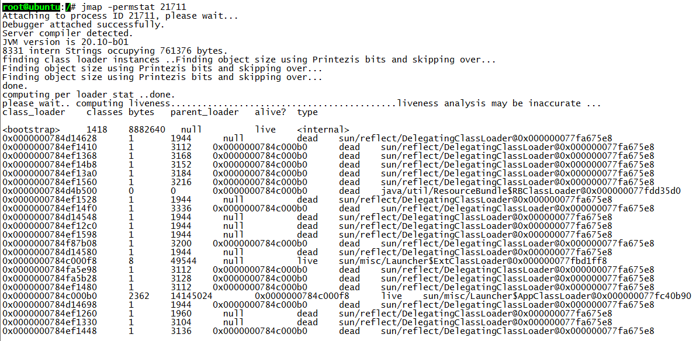
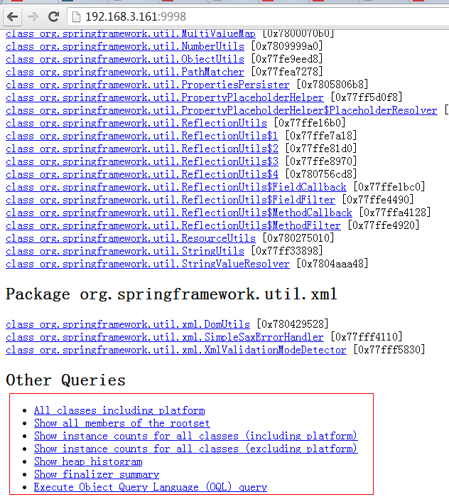
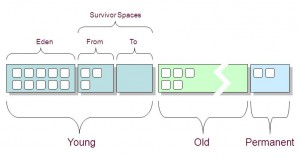

# JVM Monitoring tool


>JDK provides many convenient JVM performance tuning tool to monitor the ， in addition to the integrated VisualVM and jConsole ， and jps、jstack、jmap、jhat、jstat、hprof small tools ， this blog hope can play a valuable ， let everybody can start the common tools of JVM performance tuning understand.

In enterprise Java development, sometimes we will encounter these problems ：

* OutOfMemoryError
* Insufficient memory
* Memory leak
* Thread deadlock
* Lock contention (Lock Contention)
* Java process consumes excessive CPU

These problems in the daily development may be a lot of people ignored (for example, some people experience the above problem is to restart the server or transfer large memory, but will not go into the root of the problem), but to understand and address these issues Advanced Java programmers essential requirements. This article will be some common JVM tuning monitoring tools are introduced, hoping to play initiate use. This reference to the Internet a lot of information, it is difficult to enumerate, to express gratitude to the author of this information! About JVM performance tuning-related information, please refer to the end of the text.


## A, JPS (the Java the Status Process the Virtual Machine Tool)      

jps is mainly used to process the output of the JVM running status information. Syntax is as follows:

```bash
jps [options] [hostid]
```

If you do not specify a hostid on defaults to the current host or server.

Command line parameter options are as follows:

```bash
-q do not output the class name, Jar name and incoming main method parameters
-m output parameters passed to the main method
-l output main class or the fully qualified name of the Jar
- V  output parameter passed JVM
```

Such as the following:

```bash
@ Ubuntu root: / # JPS -m -l
Org.artifactory.standalone.main.Main 2458  / usr / local / Artifactory 2- .2.5 / etc / Jetty .xml
Com.sun.tools.hat.Main -port 9998 29920  / tmp / the dump .dat
3149 org.apache.catalina.startup.Bootstrap start
30972 sun.tools.jps.Jps -m -l
8247 org.apache.catalina.startup.Bootstrap start
25687 com.sun.tools.hat.Main -port 9999 dump.dat
21711 mrf-center.jar
```


## B, jstack

jstack primarily used to view information about a Java thread stack within the process. Syntax is as follows:

```bash
jstack [option] pid
jstack [option] executable core
jstack [Option-] [Server- the above mentioned id @] remote- hostname -OR & lt-IP
```

Command line parameter options are as follows:

```bash
-l long listings, will print additional lock information in the event of a deadlock can be used to observe jstack -l pid lock holdings
-m mixed mode, not only Java stack information output, the output will be C / C ++ stack information (such as Native Method)
```

jstack can navigate to the thread stack, the stack according to the information we can target specific code, so it is very much in use JVM performance tuning. Now we come to an instance of a Java process to find the most CPU-intensive Java threads and stack positioning information used commands are ps, top, printf, jstack, grep.

The first step is to identify the Java process ID, Java applications deployed on the server name I was mrf-center:

```bash
@ Ubuntu root: / # PS -ef | grep MRF-Center | grep -v grep
21711 1 1 14:47 PTS root / 3     00:02:10 Java -jar MRF-center.jar
```

To get the process ID is 21711, the second step in the process to find the most CPU-intensive threads, you can use the ps -Lfp pid or ps -mp pid -o THREAD, tid, time or top -Hp pid, I use a third The output is as follows:


TIME column each Java thread is consuming CPU time, CPU time is the longest thread ID to 21742 threads with

```java
the printf  "% X \ N"  21742
```

Get 21742 hexadecimal value 54ee, the following will be used.    

OK, the next step and finally turn jstack play, which is used to process the output of 21711 stack information, and then based on the hexadecimal value of the thread ID of grep, as follows:

```bash
@ Ubuntu root: / # jstack 21711 | grep 54ee
"PollIntervalRetrySchedulerThread"  PRIO = 10 = 0x00007f950043e000 NID TID = 0x54ee  in  the Object.wait () [0x00007f94c6eda000]
```

CPU consumption can be seen in this class PollIntervalRetrySchedulerThread Object.wait (), I find my code, locate the following code:
```java
// Idle wait
. getLog () the info ( "the Thread ["  + getName () +  "] IS IDLE Waiting ..." );
schedulerThreadState = PollTaskSchedulerThreadState.IdleWaiting;
Long  now = System.currentTimeMillis ();
Long  the waitTime getIdleWaitTime + = now ();
Long  timeUntilContinue = the waitTime - now;
the synchronized (sigLock) {
    the try  {
        IF (! halted.get ()) {
            sigLock.wait (timeUntilContinue);
        }
    } 
    the catch  (InterruptedException the ignore) {
    }
}
```

It is idle to wait for polling task code above sigLock.wait (timeUntilContinue) corresponds to the front of Object.wait ().


## C, jmap (Memory the Map) and jhat (Java Heap Analysis Tool)

jmap to view the heap memory usage, combined jhat general use.

jmap syntax is as follows:

```bash
jmap [option] pid
jmap [option] executable core
jmap [Option-] [Server- the above mentioned id @] remote- hostname -OR & lt-IP
```

If you are running on 64-bit JVM, you may need to specify the -J-d64 option command arguments.

```bash
jmap -permstat pid
```

Permanent generation object information class loader print process and the class loader, the output: class loader name, whether the object survival (unreliable), object address, parent class loader has been loaded class size and other information, as shown below :



Use jmap -heap pid view the process heap memory usage, including the use of GC algorithm, heap configuration parameters, and each generation heap memory usage. For example, the following example:

```bash
@ Ubuntu root: / # 21711 jmap -heap
Attaching to process ID 21711, please wait ...
Debugger attached successfully.
Server compiler detected.
JVM version is 20.10-b01
 
the Thread- a using local  Object Allocation.
Parallel GC with 4 thread (s)
 
Heap Configuration:
   MinHeapFreeRatio = 40
   MaxHeapFreeRatio = 70
   MaxHeapSize = 2067791872 (1972.0MB)
   NewSize = 1310720 (1.25MB)
   MaxNewSize = 17592186044415 MB
   OldSize = 5439488 (5.1875MB)
   NewRatio = 2
   SurvivorRatio = 8
   PermSize = 21757952 (20.75MB)
   MaxPermSize = 85983232 (82.0MB)
 
Heap Usage:
PS Young Generation
Eden Space:
   capacity = 6422528 (6.125MB)
   used = 5445552 (5.1932830810546875MB)
   as Free      = 976 976 (0.9317169189453125MB)
   84.78829520089286% used
From Space:
   capacity = 131072 (0.125MB)
   used = 98304 (0.09375MB)
   as Free      = 32768 (0.03125MB)
   75.0% used
To Space:
   capacity = 131072 (0.125MB)
   used = 0 (0.0MB)
   as Free      = 131072 (0.125MB)
   0.0% used
PS Old Generation
   capacity = 35258368 (33.625MB)
   used = 4119544 (3.9287033081054688MB)
   as Free      = 31,138,824 (29.69629669189453MB)
   11.683876009235595% used
PS Perm Generation
   capacity = 52428800 (50.0MB)
   used = 26075168 (24.867218017578125MB)
   as Free      = 26,353,632 (25.132781982421875MB)
   49.73443603515625% used
   ....
```

Use jmap -histo [: live] pid Check the number of objects in the heap memory, the size of the histogram, if only to bring live statistics living object, as follows:

```
@ Ubuntu root: / # jmap -histo: Live 21711 | More
 
 NUM      #instances #Bytes in, class name
----------------------------------------------
   1: 38445 5597736 <constMethodKlass>
   2: 38445 5237288 <methodKlass>
   3: 3500 3749504 <constantPoolKlass>
   4: 60858 3242600 <symbolKlass>
   5: 3500 2715264 <instanceKlassKlass>
   6: 2796 2131424 <constantPoolCacheKlass>
   7: 5543 1317400 [I
   8: 13714 1010768 [C
   9: 4752 1003344 [B
  10: 1225 639656 <methodDataKlass>
  11: 14194 454208 java.lang.String
  12: 3809 396136 java.lang.Class
  13: 4979 311952 [S
  14: 5598 287064 [[I
  15: 3028 266464 java.lang.reflect.Method
  16: 280 163520 <objArrayKlassKlass>
  17: 4355 139360 java.util.HashMap $ Entry
  18: 1869 138568 [Ljava.util.HashMap $ Entry;
  19: 2443 97720 java.util.LinkedHashMap $ Entry
  20: 2072 82880 java.lang.ref.SoftReference
  21: 1807 71528 [Ljava.lang.Object;
  22: 2206 70592 java.lang.ref.WeakReference
  23: 934 52304 java.util.LinkedHashMap
  24: 871 48776 java.beans.MethodDescriptor
  25: 1442 46144 java.util.concurrent.ConcurrentHashMap $ HashEntry
  26: 804 38592 java.util.HashMap
  27: 948 37920 java.util.concurrent.ConcurrentHashMap $ Segment
  28: 1621 35696 [Ljava.lang.Class;
  29: 1313 34880 [Ljava.lang.String;
  30: 1396 33504 java.util.LinkedList $ Entry
  31: 462 33264 java.lang.reflect.Field
  32: 1024 32768 java.util.Hashtable $ Entry
  33: 948 31440 [Ljava.util.concurrent.ConcurrentHashMap $ HashEntry;
```

class name is the object type, as follows:

```
B byte
C char
D double
F float
I int
J long
Z boolean
[Array, such as [I represent int []
[L + class name other objects
```

There is also a very common situation is: jmap to dump the process memory usage to a file, and then jhat analysis view. jmap carried dump command format is as follows:

```
-dump jmap: the format = B, File = dumpFileName PID
```

I'm just as to be above the process ID 21711 Dump:

```
@ Ubuntu root: / # jmap -dump: the format = B, File = / tmp / dump.dat 21711     
To the heap Dumping  / tmp / the dump .dat ...
The dump Heap  File  created
```

out of the dump file can be used MAT, VisualVM and other tools to view, here in jhat Views:

```
@ Ubuntu root: / # jhat -port 9998 /tmp/dump.dat
From Reading  / tmp / the dump .dat ...
Dump  File  created Tue On Jan 28, 2014 17:46:14 CST
Snapshot  the Read , Resolving ...
Resolving 132207 objects ...
Chasing references, expect 26 dots ..........................
Eliminating duplicate references ..........................
Snapshot resolved.
Started HTTP server on port 9998
Server is ready.
```

Note that if the Dump file is too large, you may need to add -J-Xmx512m This parameter specifies the maximum heap memory that jhat -J-Xmx512m -port 9998 /tmp/dump.dat. You can then enter the host address in the browser: 9998 View of:



Section above the red line out of the box you can own to explore, the last one to support OQL (Object Query Language).


## D, jstat-(the JVM statistics monitoring tool)

Syntax is as follows:

```
jstat [generalOption | outputOptions vmid [interval [s | ms] [count]]]
```

vmid is a Java virtual machine ID, the Linux / Unix systems in general is the process ID. interval is the sampling interval. count is the number of samples. For example, the following output is the GC information, the sampling interval is 250ms, the number of samples is 4:

```
@ Ubuntu root: / # jstat--gc 21711 250 4
 S0C S1C S0U S1U EC EU OC OU PC PU YGC YGCT FGC FGCT GCT   
192.0 192.0 64.0 0.0 6144.0 1854.9 32000.0 4111.6 55296.0 25472.7 702 3 0.431 0.218 0.649
192.0 192.0 64.0 0.0 6144.0 1972.2 32000.0 4111.6 55296.0 25472.7 702 3 0.431 0.218 0.649
192.0 192.0 64.0 0.0 6144.0 1972.2 32000.0 4111.6 55296.0 25472.7 702 3 0.431 0.218 0.649
192.0 192.0 64.0 0.0 6144.0 2109.7 32000.0 4111.6 55296.0 25472.7 702 3 0.431 0.218 0.649
```

To understand the meaning of each of the above column, look at the JVM heap memory layout:



As can be seen:

```
The young generation heap = + + permanent tenured generation generations
The young generation = Eden Area + two Survivor areas (From and To)
```

Now to explain the meaning of each column:

```
S0C, S1C, S0U, S1U: Survivor 0 /1 area capacity (Capacity) and usage (Used)
EC, EU: Eden area and capacity usage
OC, OU: the old generation capacity and usage
PC, PU: permanent generation of capacity and usage
YGC, YGT: the young generation GC and GC frequency and time-consuming
FGC, FGCT: Full GC frequency and time-consuming Full GC
GCT: GC total time
```


## E, hprof (Heap / the CPU the Profiling Tool)


hprof to show CPU usage, memory usage statistics heap.

Syntax is as follows:

```
java -agentlib: hprof [= options] ToBeProfiledClass
java -Xrunprof [: options] ToBeProfiledClass
javac -J-agentlib: hprof [= options] ToBeProfiledClass
```

Complete command options are as follows: