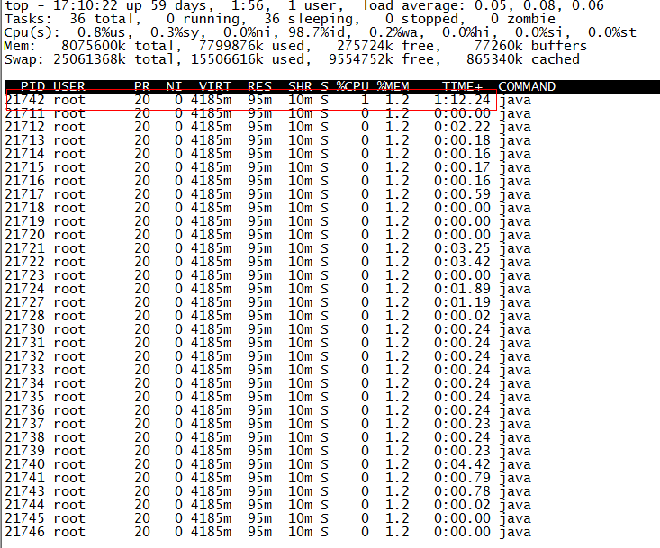

# JVM Monitoring tool


>JDK provides many convenient JVM performance tuning tool to monitor the ， in addition to the integrated VisualVM and jConsole ， and jps、jstack、jmap、jhat、jstat、hprof small tools ， this blog hope can play a valuable ， let everybody can start the common tools of JVM performance tuning understand.

In enterprise Java development, sometimes we will encounter these problems ：

* OutOfMemoryError
* Insufficient memory
* Memory leak
* Thread deadlock
* Lock contention (Lock Contention)
* Java process consumes excessive CPU

These problems in the daily development may be a lot of people ignored (for example, some people experience the above problem is to restart the server or transfer large memory, but will not go into the root of the problem), but to understand and address these issues Advanced Java programmers essential requirements. This article will be some common JVM tuning monitoring tools are introduced, hoping to play initiate use. This reference to the Internet a lot of information, it is difficult to enumerate, to express gratitude to the author of this information! About JVM performance tuning-related information, please refer to the end of the text.


## A, JPS (the Java the Status Process the Virtual Machine Tool)      

jps is mainly used to process the output of the JVM running status information. Syntax is as follows:

```bash
jps [options] [hostid]
```

If you do not specify a hostid on defaults to the current host or server.

Command line parameter options are as follows:

```bash
-q do not output the class name, Jar name and incoming main method parameters
-m output parameters passed to the main method
-l output main class or the fully qualified name of the Jar
- V  output parameter passed JVM
```

Such as the following:

```bash
@ Ubuntu root: / # JPS -m -l
Org.artifactory.standalone.main.Main 2458  / usr / local / Artifactory 2- .2.5 / etc / Jetty .xml
Com.sun.tools.hat.Main -port 9998 29920  / tmp / the dump .dat
3149 org.apache.catalina.startup.Bootstrap start
30972 sun.tools.jps.Jps -m -l
8247 org.apache.catalina.startup.Bootstrap start
25687 com.sun.tools.hat.Main -port 9999 dump.dat
21711 mrf-center.jar
```


## B, jstack

jstack primarily used to view information about a Java thread stack within the process. Syntax is as follows:

```bash
jstack [option] pid
jstack [option] executable core
jstack [Option-] [Server- the above mentioned id @] remote- hostname -OR & lt-IP
```

Command line parameter options are as follows:

```bash
-l long listings, will print additional lock information in the event of a deadlock can be used to observe jstack -l pid lock holdings
-m mixed mode, not only Java stack information output, the output will be C / C ++ stack information (such as Native Method)
```

jstack can navigate to the thread stack, the stack according to the information we can target specific code, so it is very much in use JVM performance tuning. Now we come to an instance of a Java process to find the most CPU-intensive Java threads and stack positioning information used commands are ps, top, printf, jstack, grep.

The first step is to identify the Java process ID, Java applications deployed on the server name I was mrf-center:

```bash
@ Ubuntu root: / # PS -ef | grep MRF-Center | grep -v grep
21711 1 1 14:47 PTS root / 3     00:02:10 Java -jar MRF-center.jar
```

To get the process ID is 21711, the second step in the process to find the most CPU-intensive threads, you can use the ps -Lfp pid or ps -mp pid -o THREAD, tid, time or top -Hp pid, I use a third The output is as follows:



TIME column each Java thread is consuming CPU time, CPU time is the longest thread ID to 21742 threads with

```java
the printf  "% X \ N"  21742
```

Get 21742 hexadecimal value 54ee, the following will be used.    

OK, the next step and finally turn jstack play, which is used to process the output of 21711 stack information, and then based on the hexadecimal value of the thread ID of grep, as follows:

```bash
@ Ubuntu root: / # jstack 21711 | grep 54ee
"PollIntervalRetrySchedulerThread"  PRIO = 10 = 0x00007f950043e000 NID TID = 0x54ee  in  the Object.wait () [0x00007f94c6eda000]
```

CPU consumption can be seen in this class PollIntervalRetrySchedulerThread Object.wait (), I find my code, locate the following code:
```java
// Idle wait
. getLog () the info ( "the Thread ["  + getName () +  "] IS IDLE Waiting ..." );
schedulerThreadState = PollTaskSchedulerThreadState.IdleWaiting;
Long  now = System.currentTimeMillis ();
Long  the waitTime getIdleWaitTime + = now ();
Long  timeUntilContinue = the waitTime - now;
the synchronized (sigLock) {
    the try  {
        IF (! halted.get ()) {
            sigLock.wait (timeUntilContinue);
        }
    } 
    the catch  (InterruptedException the ignore) {
    }
}
```

It is idle to wait for polling task code above sigLock.wait (timeUntilContinue) corresponds to the front of Object.wait ().


## C, jmap (Memory the Map) and jhat (Java Heap Analysis Tool)

jmap to view the heap memory usage, combined jhat general use.

jmap syntax is as follows:

```bash
jmap [option] pid
jmap [option] executable core
jmap [Option-] [Server- the above mentioned id @] remote- hostname -OR & lt-IP
```

If you are running on 64-bit JVM, you may need to specify the -J-d64 option command arguments.

```bash
jmap -permstat pid
```

Permanent generation object information class loader print process and the class loader, the output: class loader name, whether the object survival (unreliable), object address, parent class loader has been loaded class size and other information, as shown below :