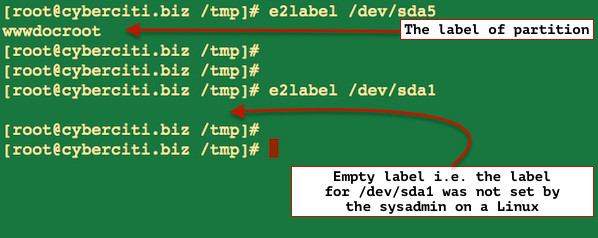

# Linux Change Disk Label Name on EXT2 / EXT3 / EXT4 File Systems

How can I modify partition labels on a Linux operating systems? How to change disk name on the ext4 file system on a Ubuntu Linux using command line?

You need to use the e2label command to set a text label to your disk drive partitions and then refer to them in the /etc/fstab file. The e2label command must be run as root user. Normal users can not modify partition label for security reasons.

###Syntax

Use the following syntax to display or change the filesystem label on the ext2, ext3, or ext4 filesystem located on device.

```
e2label /dev/device
e2label /dev/device new-label-name-here
```
 
**Label limitations**
Ext2 filesystem labels can be at most 16 characters long; if new-label-name-here is longer than 16 characters, e2label will truncate it and print a warning message on screen.

**View the label of partition**
To see the label of partition called /dev/sda5, type:

```
e2label /dev/sda5
```

Sample outputs:


**Modify partition labels / Change disk name**
To add or change the label of partition /dev/sda1 to "Webserver", enter:
```
$ sudo e2label /dev/sda1 Webserver
```

OR
```
# e2label /dev/sda1 Webserver
```

To verify new changes, type: