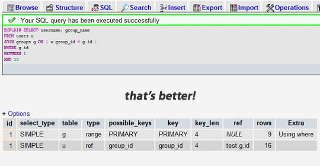
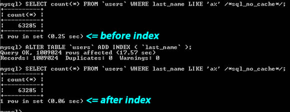

# MySQL Best Practices

Database operations often tend to be the main bottleneck for most web applications today. It's not only the DBA's (database administrators) that have to worry about these performance issues. We as programmers need to do our part by structuring tables properly, writing optimized queries and better code. Here are some MySQL optimization techniques for programmers.

###Optimize Your Queries For the Query Cache

Most MySQL servers have query caching enabled. It's one of the most effective methods of improving performance, that is quietly handled by the database engine. When the same query is executed multiple times, the result is fetched from the cache, which is quite fast.

The main problem is, it is so easy and hidden from the programmer, most of us tend to ignore it. Some things we do can actually prevent the query cache from performing its task.

```
// query cache does NOT work
$r = mysql_query("SELECT username FROM user WHERE signup_date >= CURDATE()");
 
// query cache works!
$today = date("Y-m-d");
$r = mysql_query("SELECT username FROM user WHERE signup_date >= '$today'");
```

The reason query cache does not work in the first line is the usage of the CURDATE() function. This applies to all non-deterministic functions like NOW() and RAND() etc... Since the return result of the function can change, MySQL decides to disable query caching for that query. All we needed to do is to add an extra line of PHP before the query to prevent this from happening.

###EXPLAIN Your SELECT Queries

Using the EXPLAIN keyword can give you insight on what MySQL is doing to execute your query. This can help you spot the bottlenecks and other problems with your query or table structures.

The results of an EXPLAIN query will show you which indexes are being utilized, how the table is being scanned and sorted etc...

Take a SELECT query (preferably a complex one, with joins), and add the keyword EXPLAIN in front of it. You can just use phpmyadmin for this. It will show you the results in a nice table. For example, let's say I forgot to add an index to a column, which I perform joins on:


After adding the index to the group_id field:


Now instead of scanning 7883 rows, it will only scan 9 and 16 rows from the 2 tables. A good rule of thumb is to multiply all numbers under the "rows" column, and your query performance will be somewhat proportional to the resulting number.

###LIMIT 1 When Getting a Unique Row

Sometimes when you are querying your tables, you already know you are looking for just one row. You might be fetching a unique record, or you might just be just checking the existence of any number of records that satisfy your WHERE clause.

In such cases, adding LIMIT 1 to your query can increase performance. This way the database engine will stop scanning for records after it finds just 1, instead of going thru the whole table or index.

```
// do I have any users from Alabama?
 
// what NOT to do:
$r = mysql_query("SELECT * FROM user WHERE state = 'Alabama'");
if (mysql_num_rows($r) > 0) {
    // ...
}
 
 
// much better:
$r = mysql_query("SELECT 1 FROM user WHERE state = 'Alabama' LIMIT 1");
if (mysql_num_rows($r) > 0) {
    // ...
}
```

###Index the Search Fields

Indexes are not just for the primary keys or the unique keys. If there are any columns in your table that you will search by, you should almost always index them.



As you can see, this rule also applies on a partial string search like "last_name LIKE 'a%'". When searching from the beginning of the string, MySQL is able to utilize the index on that column.

You should also understand which kinds of searches can not use the regular indexes. For instance, when searching for a word (e.g. "WHERE post_content LIKE '%apple%'"), you will not see a benefit from a normal index. You will be better off using mysql fulltext search or building your own indexing solution.

###Index and Use Same Column Types for Joins

If your application contains many JOIN queries, you need to make sure that the columns you join by are indexed on both tables. This affects how MySQL internally optimizes the join operation.

Also, the columns that are joined, need to be the same type. For instance, if you join a DECIMAL column, to an INT column from another table, MySQL will be unable to use at least one of the indexes. Even the character encodings need to be the same type for string type columns.

```
// looking for companies in my state
$r = mysql_query("SELECT company_name FROM users
    LEFT JOIN companies ON (users.state = companies.state)
    WHERE users.id = $user_id");
 
// both state columns should be indexed
// and they both should be the same type and character encoding
// or MySQL might do full table scans
```

###Do Not ORDER BY RAND()

This is one of those tricks that sound cool at first, and many rookie programmers fall for this trap. You may not realize what kind of terrible bottleneck you can create once you start using this in your queries.

If you really need random rows out of your results, there are much better ways of doing it. Granted it takes additional code, but you will prevent a bottleneck that gets exponentially worse as your data grows. The problem is, MySQL will have to perform RAND() operation (which takes processing power) for every single row in the table before sorting it and giving you just 1 row.

```
// what NOT to do:
$r = mysql_query("SELECT username FROM user ORDER BY RAND() LIMIT 1");
 
 
// much better:
 
$r = mysql_query("SELECT count(*) FROM user");
$d = mysql_fetch_row($r);
$rand = mt_rand(0,$d[0] - 1);
 
$r = mysql_query("SELECT username FROM user LIMIT $rand, 1");
```

So you pick a random number less than the number of results and use that as the offset in your LIMIT clause.

###Avoid SELECT *

The more data is read from the tables, the slower the query will become. It increases the time it takes for the disk operations. Also when the database server is separate from the web server, you will have longer network delays due to the data having to be transferred between the servers.

It is a good habit to always specify which columns you need when you are doing your SELECT's.

```
// not preferred
$r = mysql_query("SELECT * FROM user WHERE user_id = 1");
$d = mysql_fetch_assoc($r);
echo "Welcome {$d['username']}";
 
// better:
$r = mysql_query("SELECT username FROM user WHERE user_id = 1");
$d = mysql_fetch_assoc($r);
echo "Welcome {$d['username']}";
 
// the differences are more significant with bigger result sets
```

###Almost Always Have an id Field

In every table have an id column that is the PRIMARY KEY, AUTO_INCREMENT and one of the flavors of INT. Also preferably UNSIGNED, since the value can not be negative.

Even if you have a users table that has a unique username field, do not make that your primary key. VARCHAR fields as primary keys are slower. And you will have a better structure in your code by referring to all users with their id's internally.

There are also behind the scenes operations done by the MySQL engine itself, that uses the primary key field internally. Which become even more important, the more complicated the database setup is. (clusters, partitioning etc...).

One possible exception to the rule are the "association tables", used for the many-to-many type of associations between 2 tables. For example a "posts_tags" table that contains 2 columns: post_id, tag_id, that is used for the relations between two tables named "post" and "tags". These tables can have a PRIMARY key that contains both id fields.