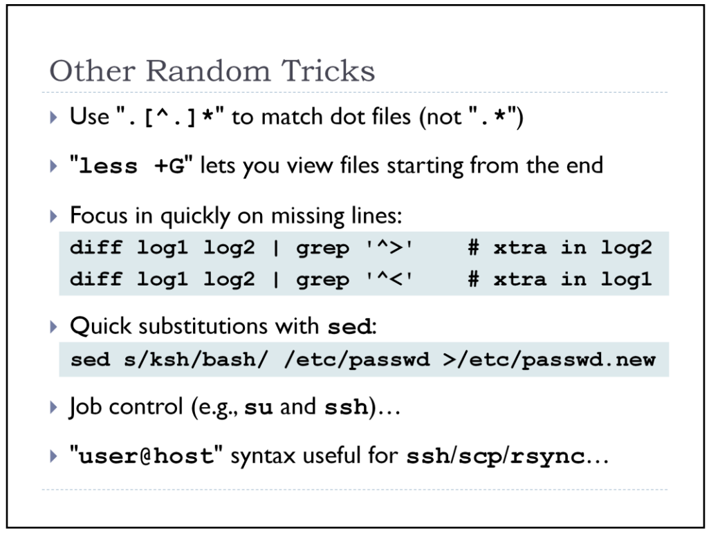

# Scripts

```
for i in $(ls); do echo "$i $(ls $i | wc -l)"; done
```




#### List of commands you use most often:
```
history | awk '{a[$2]++}END{for(i in a){print a[i] " " i}}' | sort -rn | head
```

#### How to archive all the files that are not modified in the last x number of days?

The following command finds all the files not modified in the last 60 days under /home/jsmith directory and creates an archive files under /tmp in the format of ddmmyyyy_archive.tar.
```
# find /home/jsmith -type f -mtime +60 | xargs tar -cvf
/tmp/`date '+%d%m%Y'_archive.tar`
```

#### Suppress standard output using > /dev/null

This will be very helpful when you are debugging shell scripts, where you don’t want to display the echo statement and interested in only looking at the error messages.

```
# cat file.txt > /dev/null
# ./shell-script.sh > /dev/null
```

#### Suppress standard error using 2> /dev/null

This is also helpful when you are interested in viewing only the standard output and don’t want to view the error messages.

```
# cat invalid-file-name.txt 2> /dev/null
# ./shell-script.sh 2> /dev/null
```

Note: One of the most effective ways to use this is in the crontab, where you can suppress the output and error message of a cron task as shown below.
```
  30 1 * * * command > /dev/null 2>&1
```