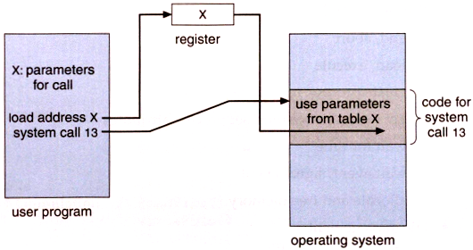

# System Calls

The system call provides an interface to the operating system services.

Application developers often do not have direct access to the system calls, but can access them through an application programming interface (API). The functions that are included in the API invoke the actual system calls. By using the API, certain benefits can be gained:

Portability: as long a system supports an API, any program using that API can compile and run.
Ease of Use: using the API can be significantly easier then using the actual system call.

1. System Call Paramaters
Three general methods exist for passing parameters to the OS:
Parameters can be passed in registers.
When there are more parameters than registers, parameters can be stored in a block and the block address can be passed as a parameter to a register.
Parameters can also be pushed on or popped off the stack by the operating system.

2. Types of System Calls
There are 5 different categories of system calls:
process control, file manipulation, device manipulation, information maintenance and communication.
1.12.2.1. Process Control
A running program needs to be able to stop execution either normally or abnormally. When execution is stopped abnormally, often a dump of memory is taken and can be examined with a debugger.

3. File Management
Some common system calls are create, delete, read, write, reposition, or close. Also, there is a need to determine the file attributes – get and set file attribute. Many times the OS provides an API to make these system calls.

4. Device Management
Process usually require several resources to execute, if these resources are available, they will be granted and control returned to the user process. These resources are also thought of as devices. Some are physical, such as a video card, and others are abstract, such as a file.
User programs request the device, and when finished they release the device. Similar to files, we can read, write, and reposition the device.

5. Information Management
Some system calls exist purely for transferring information between the user program and the operating system. An example of this is time, or date.
The OS also keeps information about all its processes and provides system calls to report this information.

6. Communication
There are two models of interprocess communication, the message-passing model and the shared memory model.
Message-passing uses a common mailbox to pass messages between processes.
Shared memory use certain system calls to create and gain access to create and gain access to regions of memory owned by other processes. The two processes exchange information by reading and writing in the shared data.