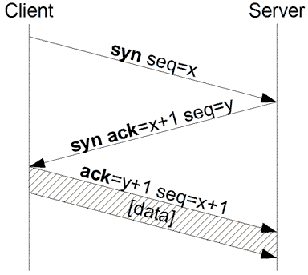

# TCP connection

* Step1:
Machine 1 wants to initiate a connection with machine 2, So machine 1 sends a segment with SYN(Synchronize Sequence Number). This segment will inform the machine 2 that Machine 1 would like to start a communication with Machine 2 and informs machine 2 what sequence number it will start its segments with.

Note: Sequence Numbers are mainly used to keep data in order.

* Step2: 
Machine 2 will respond to Machine 1 with "Acknowledgment" (ACK) and SYN bits set. Now machine 2's ACK segment does two things; they are as below.

  1. It acknowledges machine 1's SYN segment.
  2. It informs Machine 1 what sequence number it will start its data with.

* Step 3: 
Now finally machine 1 Acknowledges Machine 2's initial sequence Number and its ACK signal. And then Machine 1 will start the actual data transffer.

**Note: Initial Sequence Numbers are randomly selected while initiating connections between two machines.**

* TCP has the client and server exchange transport- layer control information with each other before the application-level messages begin to flow. This so-called handshaking procedure alerts the client and server, allowing them to prepare for an onslaught of packets. After the handshaking phase, a TCP connection is said to exist between the sockets of the two processes. The connection is a full-duplex connection in that the two processes can send messages to each other over the connection at the same time. When the application finishes sending messages, it must tear down the connection. In Chapter 3 we’ll discuss connection-oriented service in detail and examine how it is implemented.

* Reliable data transfer service. The communicating processes can rely on TCP to deliver all data sent without error and in the proper order. When one side of the application passes a stream of bytes into a socket, it can count on TCP to deliver the same stream of bytes to the receiving socket, with no missing or duplicate bytes.

TCP also includes a congestion-control mechanism, a service for the general welfare of the Internet rather than for the direct benefit of the communicating processes. The TCP congestion-control mechanism throttles a sending process (client or server) when the network is congested between sender and receiver. As we will see in Chapter 3, TCP congestion control also attempts to limit each TCP connection to its fair share of network bandwidth.

TCP congestion control prevents any one TCP con- nection from swamping the links and routers between communicating hosts with an excessive amount of traffic. 