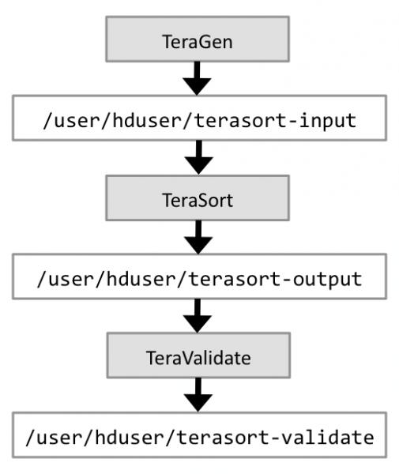

# TeraSort benchmark suite

The TeraSort benchmark is probably the most well-known Hadoop benchmark. Back in 2008, Yahoo! set a record by sorting 1 TB of data in 209 seconds – on an Hadoop cluster of 910 nodes as Owen O’Malley of the Yahoo! Grid Computing Team reports. One year later in 2009, Yahoo! set another record by sorting a 1 PB (1’000 TB) of data in 16 hours on an even larger Hadoop cluster of 3800 nodes (it took the same cluster only 62 seconds to sort 1 TB of data, easily beating the previous year’s record!).

Basically, the goal of TeraSort is to sort 1TB of data (or any other amount of data you want) as fast as possible. It is a benchmark that combines testing the HDFS and MapReduce layers of an Hadoop cluster. As such it is not surprising that the TeraSort benchmark suite is often used in practice, which has the added benefit that it allows us – among other things – to compare the results of our own cluster with the clusters of other people. You can use the TeraSort benchmark, for instance, to iron out your Hadoop configuration after your cluster passed a convincing TestDFSIO benchmark first. Typical areas where TeraSort is helpful is to determine whether your map and reduce slot assignments are sound (as they depend on the variables such as the number of cores per TaskTracker node and the available RAM), whether other MapReduce-related parameters such as io.sort.mb and mapred.child.java.opts are set to proper values, or whether the FairScheduler configuration you came up with really behaves as expected.

A full TeraSort benchmark run consists of the following three steps:

1. Generating the input data via TeraGen.
2. Running the actual TeraSort on the input data.
3. Validating the sorted output data via TeraValidate.

You do not need to re-generate input data before every TeraSort run (step 2). So you can skip step 1 (TeraGen) for later TeraSort runs if you are satisfied with the generated data.

Figure 1 shows the basic data flow. We use the included HDFS directory names in the later examples.



Figure 1: Hadoop Benchmarking and Stress Testing: The basic data flow of the TeraSort benchmark suite

The next sections describe each of the three steps in greater detail.

###TeraGen: Generate the TeraSort input data (if needed)

TeraGen (source code) generates random data that can be conveniently used as input data for a subsequent TeraSort run.

The syntax for running TeraGen is as follows:

```
$ hadoop jar hadoop-*examples*.jar teragen <number of 100-byte rows> <output dir>
```

Using the HDFS output directory /user/hduser/terasort-input as an example, the command to run TeraGen in order to generate 1TB of input data (i.e. 1,000,000,000,000 bytes) is:

```
$ hadoop jar hadoop-*examples*.jar teragen 10000000000 /user/hduser/terasort-input
```

Please note that the first parameter supplied to TeraGen is 10 billion (10,000,000,000), i.e. not 1 trillion = 1 TB (1,000,000,000,000). The reason is that the first parameter specifies the number of rows of input data to generate, each of which having a size of 100 bytes.

Here is the actual TeraGen data format per row to clear things up:

```
<10 bytes key><10 bytes rowid><78 bytes filler>\r\n
```

where

1. The keys are random characters from the set ‘ ‘ .. ‘~’.
2. The rowid is the right justified row id as a int.
3. The filler consists of 7 runs of 10 characters from ‘A’ to ‘Z’.

If you have a very fast cluster, your map tasks might finish in a few seconds if you use a relatively small default HDFS block size such as 128MB (which is not a bad idea though in general). This means that the time to start/stop map tasks might be larger than the time to perform the actual task. In other words, the overhead for managing the TaskTrackers might exceed the job’s “payload”. An easy way to work around this is to increase the HDFS block size for files written by TeraGen. Keep in mind that the HDFS block size is a per-file setting, and the value specified by the dfs.block.size property in hdfs-default.xml (or conf/hdfs-site.xml if you use a custom configuration file) is just a default value. So if, for example, you want to use an HDFS block size of 512MB (i.e. 536870912 bytes) for the TeraSort benchmark suite, overwrite dfs.block.size when running TeraGen:

```
$ hadoop jar hadoop-*examples*.jar teragen -D dfs.block.size=536870912 ...
```

