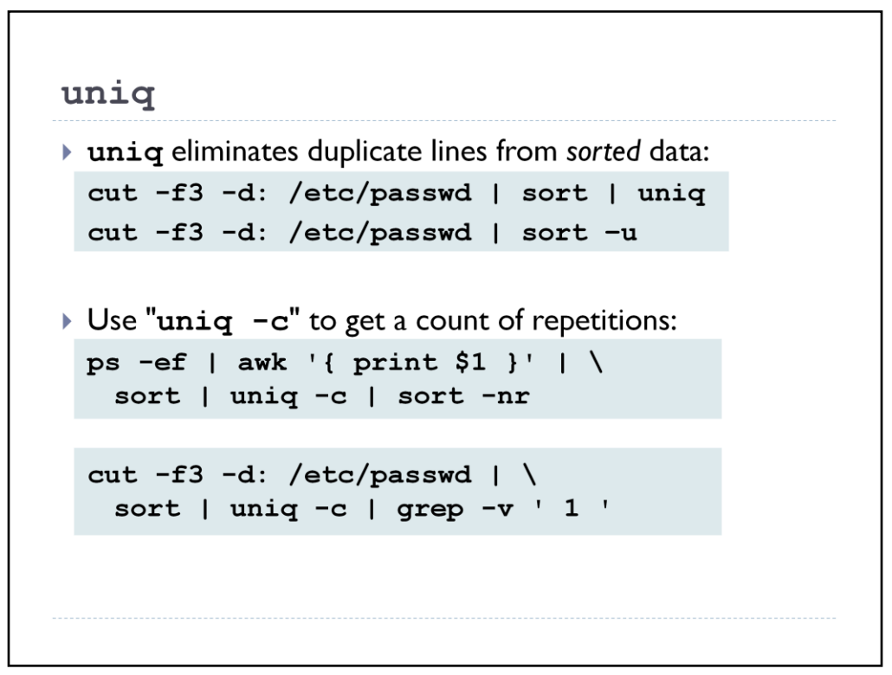

# Uniq



```
$ ps -ef | awk '{ print $1 }' | sort | uniq -c | sort -nr
 34 root
 8 apache
 7 hal
 1 UID
 1 rpc
 1 ntp
 1 mysql
 1 dbus
```

The "1 UID" line is a result of the initial header line from ps. If we wanted to get rid of
that we could do something like "ps -ef | tail +2 | awk …", but the above is
good enough for most purposes.

When you have an employee file with duplicate entries, you can do the following to remove duplicates.
```
$ sort namesd.txt | uniq
$ sort –u namesd.txt
```

If you want to know how many lines are duplicates, do the following. The first field in the following examples indicates how many duplicates where found for that particular line. So, in this example the lines beginning with Alex and Emma were found twice in the namesd.txt file.

```
$ sort namesd.txt | uniq –c
      2 Alex Jason:200:Sales
      2 Emma Thomas:100:Marketing
      1 Madison Randy:300:Product Development
      1 Nisha Singh:500:Sales
      1 Sanjay Gupta:400:Support
```
